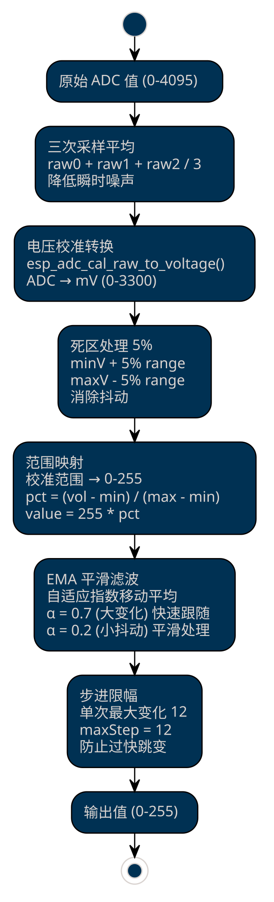
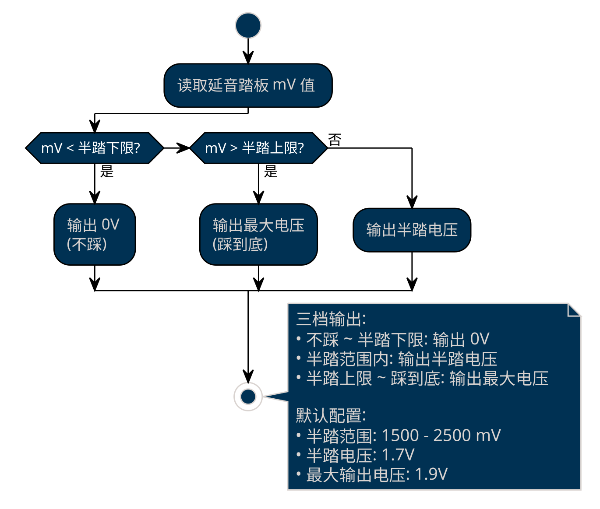
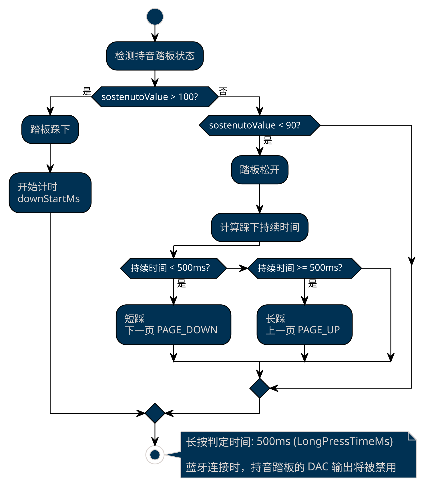
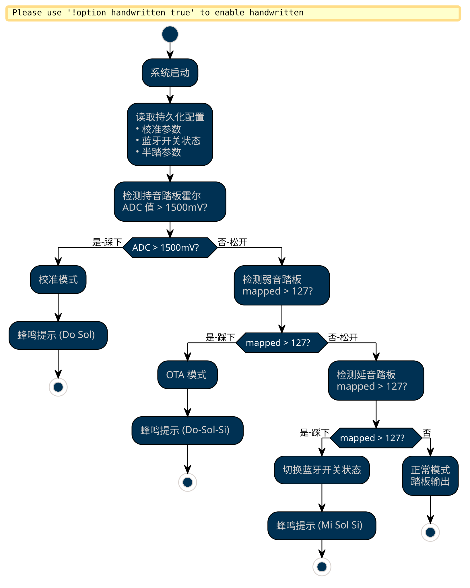
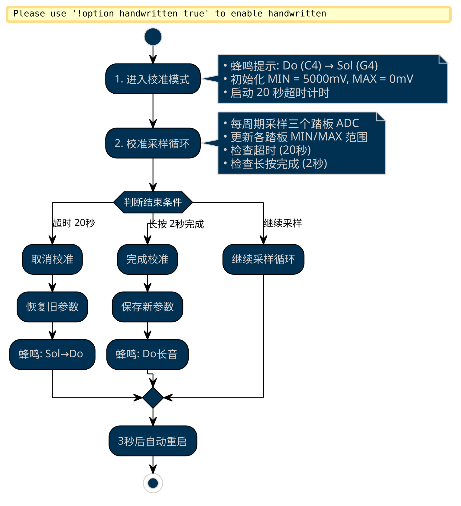
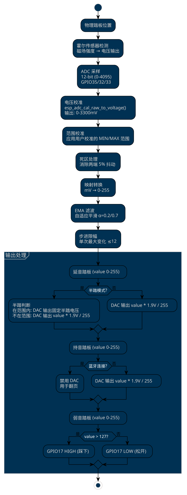
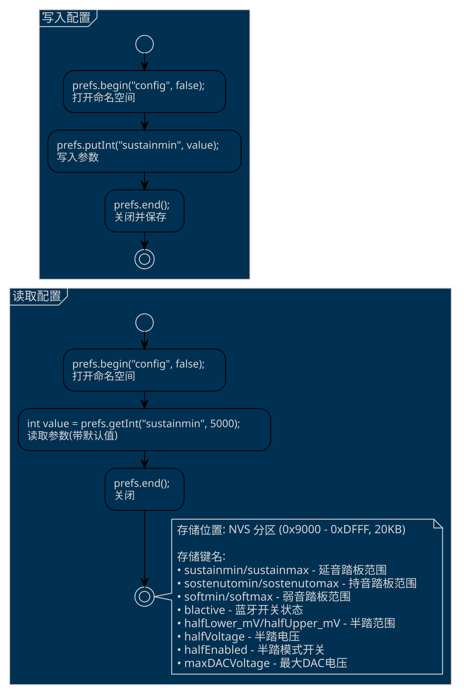

# ESP32 钢琴踏板控制器 - 业务功能逻辑文档

> **项目版本**: v1.3.0  
> **目标硬件**: ESP32-WROOM-32 (4MB Flash, 448KB ROM, 520KB SRAM)  
> **文档日期**: 2026年4月6日

---

## 目录

1. [系统概述](#1-系统概述)
2. [硬件架构](#2-硬件架构)
3. [核心功能模块](#3-核心功能模块)
4. [工作模式详解](#4-工作模式详解)
5. [数据流与信号处理](#5-数据流与信号处理)
6. [配置与存储](#6-配置与存储)
7. [功耗管理](#7-功耗管理)
8. [API接口](#8-api接口)
9. [故障处理与恢复](#9-故障处理与恢复)

---

## 1. 系统概述

### 1.1 产品定位

ESP32 钢琴踏板控制器是一个将传统钢琴三个踏板（延音、持音、弱音）转换为电信号输出的智能设备，支持：

- **模拟电压输出**：通过 DAC 输出连续电压信号，兼容传统钢琴踏板接口
- **蓝牙翻页功能**：通过 BLE 键盘协议实现乐谱翻页
- **OTA 固件更新**：支持无线固件升级
- **霍尔传感器校准**：自动适应不同踏板行程范围

### 1.2 系统架构图

```
┌─────────────────────────────────────────────────────────────────────┐
│                        ESP32 钢琴踏板控制器                          │
├─────────────────────────────────────────────────────────────────────┤
│                                                                     │
│  ┌─────────────┐    ┌─────────────┐    ┌─────────────┐             │
│  │  延音踏板   │    │  持音踏板   │    │  弱音踏板   │             │
│  │  (Sustain)  │    │ (Sostenuto) │    │   (Soft)    │             │
│  └──────┬──────┘    └──────┬──────┘    └──────┬──────┘             │
│         │                  │                  │                     │
│         ▼                  ▼                  ▼                     │
│  ┌─────────────┐    ┌─────────────┐    ┌─────────────┐             │
│  │ 霍尔传感器  │    │ 霍尔传感器  │    │ 霍尔传感器  │             │
│  │  ADC_CH4   │    │  ADC_CH5   │    │  ADC_CH7   │             │
│  └──────┬──────┘    └──────┬──────┘    └──────┬──────┘             │
│         │                  │                  │                     │
│         ▼                  ▼                  ▼                     │
│  ┌─────────────────────────────────────────────────────────┐       │
│  │                    ADC 采样与处理                        │       │
│  │  • 三次采样平均降噪                                      │       │
│  │  • 电压校准 (esp_adc_cal)                                │       │
│  │  • 死区处理 (5%)                                         │       │
│  │  • EMA 平滑滤波                                          │       │
│  │  • 映射到 0-255                                          │       │
│  └─────────────────────────────────────────────────────────┘       │
│         │                  │                  │                     │
│         ▼                  ▼                  ▼                     │
│  ┌─────────────┐    ┌─────────────┐    ┌─────────────┐             │
│  │ DAC 输出    │    │ DAC 输出    │    │ GPIO 开关   │             │
│  │ GPIO25     │    │ GPIO26     │    │ GPIO17     │             │
│  │ (半踏支持)  │    │            │    │            │             │
│  └──────┬──────┘    └──────┬──────┘    └──────┬──────┘             │
│         │                  │                  │                     │
│         ▼                  ▼                  ▼                     │
│  ┌─────────────────────────────────────────────────────────┐       │
│  │                    外部设备连接                          │       │
│  │  • 钢琴/电子琴踏板接口                                   │       │
│  │  • MIDI 控制器                                          │       │
│  └─────────────────────────────────────────────────────────┘       │
│                                                                     │
│  ┌─────────────────────────────────────────────────────────┐       │
│  │                    BLE 键盘模块                          │       │
│  │  • 蓝牙名称: "翻页器"                                    │       │
│  │  • 翻页逻辑: 短踩下一页，长踩上一页                       │       │
│  └─────────────────────────────────────────────────────────┘       │
│                                                                     │
│  ┌─────────────────────────────────────────────────────────┐       │
│  │                    OTA 更新模块                          │       │
│  │  • WiFi AP 模式                                         │       │
│  │  • Web 界面固件上传                                      │       │
│  │  • 实时踏板状态显示                                      │       │
│  │  • 半踏参数配置                                          │       │
│  └─────────────────────────────────────────────────────────┘       │
│                                                                     │
└─────────────────────────────────────────────────────────────────────┘
```

---

## 2. 硬件架构

### 2.1 引脚定义

| 功能分类 | 引脚 | GPIO | 说明 |
|---------|------|------|------|
| **DAC 输出** | 延音踏板电压 | GPIO25 | DAC 通道 1，输出 0-1.9V |
| | 持音踏板电压 | GPIO26 | DAC 通道 2，输出 0-1.9V |
| **开关输出** | 弱音踏板开关 | GPIO17 | 数字输出，高电平=踩下 |
| **ADC 输入** | 延音踏板霍尔 | GPIO35 | ADC1_CH7，11dB 衰减 |
| | 持音踏板霍尔 | GPIO32 | ADC1_CH4，11dB 衰减 |
| | 弱音踏板霍尔 | GPIO33 | ADC1_CH5，11dB 衰减 |
| **按钮输入** | 延音踏板按钮 | GPIO27 | 内部上拉，低电平有效 |
| | 持音踏板按钮 | GPIO14 | 内部上拉，低电平有效 |
| | 弱音踏板按钮 | GPIO13 | 内部上拉，低电平有效 |
| **音频反馈** | 蜂鸣器 | GPIO16 | LEDC PWM，2KHz |

### 2.2 电气参数

| 参数 | 值 | 说明 |
|-----|-----|------|
| DAC 最大输出电压 | 1.9V | 实测最大稳定输出 |
| ADC 采样范围 | 0-3300mV | 11dB 衰减，12-bit 分辨率 |
| ADC 校准基准 | 1100mV | eFuse Vref |
| 主循环周期 | 5ms | 采样频率 200Hz |
| 蜂鸣器频率 | 2KHz | PWM 驱动 |

### 2.3 分区表布局

```
# Partition Table (partition.csv)
# 总大小: 4MB Flash

分区名称    类型      子类型    偏移地址      大小
─────────────────────────────────────────────────────
nvs        data      nvs      0x9000       20KB    (配置存储)
otadata    data      ota      0xe000       8KB     (OTA状态)
app0       app       ota_0    0x10000      1.75MB  (应用分区0)
app1       app       ota_1    0x1C0000     1.75MB  (应用分区1)
coredump   data      coredump 0x370000     64KB    (崩溃转储)
spiffs     data      spiffs   0x380000     512KB   (文件系统)
```

---

## 3. 核心功能模块

### 3.1 踏板信号处理模块

#### 3.1.1 ADC 采样流程



#### 3.1.2 半踏兼容模式（延音踏板专属）

半踏兼容模式为延音踏板提供三档输出，兼容不支持连续踏板信号的设备。



**参数配置方式**：
- OTA Web 界面调整
- API 接口：
  - `/setHalfPedal?lower=xxx&upper=xxx&voltage=xxx` - 半踏范围和电压
  - `/setHalfPedalEnabled?enabled=1` - 开启/关闭半踏兼容模式
  - `/setMaxDACVoltage?voltage=xxx` - 设置最大输出电压

### 3.2 蓝牙翻页模块

#### 3.2.1 BLE 键盘配置

```cpp
BleKeyboard bleKeyboard("翻页器", "Ning", 100);
// 设备名称: 页器
// 制造商: Ning
// 电池电量: 100%
```

#### 3.2.2 翻页逻辑



**注意**：蓝牙翻页模式下，持音踏板的 DAC 输出将被禁用。

### 3.3 OTA 固件更新模块

#### 3.3.1 OTA 架构

```
┌─────────────────────────────────────────────────────────────┐
│                    OTA 更新系统架构                          │
├─────────────────────────────────────────────────────────────┤
│                                                             │
│  ┌─────────────────────────────────────────────────────┐   │
│  │                 WiFi AP 模式                         │   │
│  │  SSID: "钢琴踏板固件更新"                             │   │
│  │  IP: 192.168.4.1                                     │   │
│  │  无密码开放热点                                       │   │
│  │  最大连接数: 1                                        │   │
│  └─────────────────────────────────────────────────────┘   │
│                         │                                   │
│                         ▼                                   │
│  ┌─────────────────────────────────────────────────────┐   │
│  │                 DNS 服务器                           │   │
│  │  劫持所有 DNS 请求 → 192.168.4.1                     │   │
│  │  实现 Captive Portal 自动弹出网页                    │   │
│  └─────────────────────────────────────────────────────┘   │
│                         │                                   │
│                         ▼                                   │
│  ┌─────────────────────────────────────────────────────┐   │
│  │                 Web 服务器                           │   │
│  │  端口: 80                                            │   │
│  │  路由:                                               │   │
│  │    /          → 主页 (固件上传界面)                  │   │
│  │    /status   → 踏板状态 JSON                         │   │
│  │    /setHalfPedal → 半踏参数设置                      │   │
│  │    /update   → 固件上传处理                          │   │
│  │    其他      → 重定向到主页                          │   │
│  └─────────────────────────────────────────────────────┘   │
│                                                             │
└─────────────────────────────────────────────────────────────┘
```

#### 3.3.2 Web 界面功能

| 功能 | 说明 |
|-----|------|
| 固件上传 | 选择 .bin 文件，进度条显示上传进度 |
| 踏板状态 | 三个竖向进度条实时显示踏板位置 |
| 半踏配置 | 拖动滑块调整半踏范围，下拉选择半踏电压 |
| 版本显示 | 显示当前固件版本号 |

#### 3.3.3 API 接口

**状态查询**:
```http
GET /status
Response:
{
  "p0": {"mv": 1200, "min": 500, "max": 2800, "mapped": 45},  // 弱音
  "p1": {"mv": 1500, "min": 600, "max": 2900, "mapped": 60},  // 持音
  "p2": {"mv": 2000, "min": 400, "max": 3000, "mapped": 80},  // 延音
  "halfPedal": {
    "lower": 1500,
    "upper": 2500,
    "voltage": 1.7,
    "enabled": false,
    "maxDACVoltage": 1.9
  }
}
```

**半踏参数设置**:
```http
GET /setHalfPedal?lower=1500&upper=2500&voltage=1.7
Response: {"success": true}
```

**半踏兼容模式开关**:
```http
GET /setHalfPedalEnabled?enabled=1
Response: {"success": true}
```

**最大输出电压设置**:
```http
GET /setMaxDACVoltage?voltage=1.9
Response: {"success": true}
```

---

## 4. 工作模式详解

### 4.1 模式切换流程



### 4.2 各模式详细说明

#### 4.2.1 正常模式

**触发条件**: 开机时三个踏板均未踩下

**功能行为**:
- 持续采样三个踏板霍尔传感器
- DAC 输出延音/持音踏板电压信号
- GPIO 输出弱音踏板开关信号
- 牙翻页功能（如果已启用）

**主循环周期**: 5ms

#### 4.2.2 校准模式

**触发条件**: 开机时踩住持音踏板 (ADC > 1500mV)

**校准流程**:



**校准参数存储**:
```cpp
// Preferences 键名映射
"sustainmin"     → 延音踏板最小值 (mV)
"sustainmax"     → 延音踏板最大值 (mV)
"sostenutomin"   → 持音踏板最小值 (mV)
"sostenutomax"   → 持音踏板最大值 (mV)
"softmin"        → 弱音踏板最小值 (mV)
"softmax"        → 弱音踏板最大值 (mV)
```

#### 4.2.3 OTA 模式

**触发条件**: 开机时踩住弱音踏板 (mapped > 127)

**模式行为**:
- 创建 WiFi AP 热点
- 启动 DNS 服务器（Captive Portal）
- 启动 Web 服务器
- 禁用蓝牙（避免内存冲突）
- 实时显示踏板状态

**退出方式**: 固件上传完成后自动重启

#### 4.2.4 蓝牙切换模式

**触发条件**: 开机时踩住延音踏板 (mapped > 127)

**模式行为**:
- 切换蓝牙开关状态
- 保存状态到 Preferences
- 蜂鸣提示 (Mi Sol Si)

---

## 5. 数据流与信号处理

### 5.1 踏板信号数据流



### 5.2 信号处理算法详解

#### 5.2.1 自适应 EMA 滤波

```cpp
// 自适应指数移动平均
float delta = valueRaw - s_ema[idx];
float alpha = (abs((int)delta) > 15) ? 0.7f : 0.2f;
s_ema[idx] = s_ema[idx] + alpha * delta;

// α = 0.7: 大幅变化时快速跟随
// α = 0.2: 小抖动时平滑处理
```

#### 5.2.2 步进限幅

```cpp
// 限制单次最大变化，防止过快跳变
const int maxStep = 12;
int step = emaInt - s_lastOut[idx];
if (step > maxStep) step = maxStep;
else if (step < -maxStep) step = -maxStep;
s_lastOut[idx] = s_lastOut[idx] + step;
```

#### 5.2.3 微抖动死区

```cpp
// 差值 ≤1 不更新，避免 1 级跳动
if (abs(emaInt - s_lastOut[idx]) <= 1) {
    // 保持上次输出
}
```

---

## 6. 配置与存储

### 6.1 Preferences 存储结构

| 键名 | 类型 | 默认值 | 说明 |
|-----|------|-------|------|
| `sustainmin` | int | 5000 | 延音踏板最小电压 (mV) |
| `sustainmax` | int | 0 | 延音踏板最大电压 (mV) |
| `sostenutomin` | int | 5000 | 持音踏板最小电压 (mV) |
| `sostenutomax` | int | 0 | 持音踏板最大电压 (mV) |
| `softmin` | int | 5000 | 弱音踏板最小电压 (mV) |
| `softmax` | int | 0 | 弱音踏板最大电压 (mV) |
| `blactive` | bool | false | 蓝牙翻页开关状态 |
| `halfLower_mV` | int | 1500 | 半踏范围下限 (mV) |
| `halfUpper_mV` | int | 2500 | 半踏范围上限 (mV) |
| `halfVoltage` | float | 1.7 | 半踏输出电压 (V) |
| `halfEnabled` | bool | false | 半踏兼容模式开关 |
| `maxDACVoltage` | float | 1.9 | 最大DAC输出电压 (V) |

### 6.2 配置读写流程



---

## 7. 功耗管理

### 7.1 动态电源管理配置

```cpp
esp_pm_config_esp32_t pm_config = {
    .max_freq_mhz = 80,        // 最高频率
    .min_freq_mhz = 10,        // 最低频率（空闲时自动降频）
    .light_sleep_enable = true // 启用轻睡眠模式
};
esp_pm_configure(&pm_config);
```

### 7.2 看门狗配置

```cpp
esp_task_wdt_init(30, true);  // 30秒超时
esp_task_wdt_add(NULL);       // 注册当前任务
```

### 7.3 无线模块管理

| 模式 | WiFi | BLE | 说明 |
|-----|------|-----|------|
| 正常模式 | OFF | ON (可选) | 关闭 WiFi 节约功耗 |
| OTA 模式 | AP | OFF | 禁用 BLE 避免内存冲突 |
| 蓝牙翻页 | OFF | ON | BLE 键盘模式 |

---

## 8. API接口

### 8.1 OTA Web API

| 接口 | 方法 | 参数 | 说明 |
|-----|------|------|------|
| `/` | GET | - | 主页界面 |
| `/status` | GET | - | 获取踏板状态 JSON |
| `/setHalfPedal` | GET | lower, upper, voltage | 设置半踏参数 |
| `/update` | POST | file | 上传固件 |

### 8.2 C 函数接口

```cpp
// 校准相关
void SaveCalibration();
void ReadCalibration();
void StartCalibration();
void FinishCalibration();

// 蓝牙相关
void ReadBluetoothActive();
void SaveBluetoothActive();
void ShutdownBluetooth();

// 半踏相关
int GetSustainHalfPedalLower_mV();
int GetSustainHalfPedalUpper_mV();
void SetSustainHalfPedalRange_mV(int lower_mV, int upper_mV);
float GetHalfPedalVoltage();
void SetHalfPedalVoltage(float voltage);

// OTA 相关
void otaPortalBegin();
void otaPortalHandle();
void otaPortalStop();
bool otaPortalActive();
void otaPortalSetPedalStatus(int index, int mv, int minv, int maxv, int mapped);
```

---

## 9. 故障处理与恢复

### 9.1 看门狗超时

- **超时时间**: 30 秒
- **行为**: 系统自动重启
- **防护**: 主循环每周期喂狗 `esp_task_wdt_reset()`

### 9.2 校准超时

- **超时时间**: 20 秒
- **行为**: 取消校准，恢复旧参数，蜂鸣提示 (Sol→Do)
- **重启**: 3 秒后自动重启

### 9.3 OTA 更新失败

- **检测**: `Update.hasError()`
- **响应**: HTTP 500 错误
- **恢复**: 保持旧固件运行

### 9.4 蜂鸣提示编码

| 提示场景 | 音调序列 | 音符 |
|---------|---------|------|
| 进入校准 | Do → Sol | C4 → G4 |
| 校准完成 | Do (长音) | C4 (240ms) |
| 校准取消 | Sol → Do | G4 → C4 |
| 进入 OTA | Do→Sol→Si | C4→G4→B4 (上行) |
| 蓝牙开启 | Mi → Sol → Si | E4 → G4 → B4 |

---

## 附录

### A. 版本历史

| 版本 | 日期 | 变更说明 |
|-----|------|---------|
| v1.2.0 | 2026-04 | 半踏功能、OTA Web 配置界面 |
| v1.1.0 | - | 蓝牙翻页功能 |
| v1.0.0 | - | 基础踏板输出功能 |

### B. 依赖库

| 库名 | 版本 | 用途 |
|-----|------|------|
| ESP32 BLE Keyboard | 0.3.2 | 蓝牙键盘协议 |
| Arduino Framework | - | 基础框架 |
| Preferences | - | 配置存储 |
| WebServer | - | OTA Web 服务 |
| DNSServer | - | Captive Portal |

### C. 编译配置

```ini
build_flags =
    -DESP32_WROOM_32
    -DFW_VERSION=\"1.2.0\"
    -DESP32_FLASH_BYTES=4194304
    -DESP32_ROM_BYTES=458752
    -DESP32_SRAM_BYTES=532480
    -DESP32_CRYSTAL_MHZ=40
```

---

**文档维护**: 请随代码更新同步维护此文档。